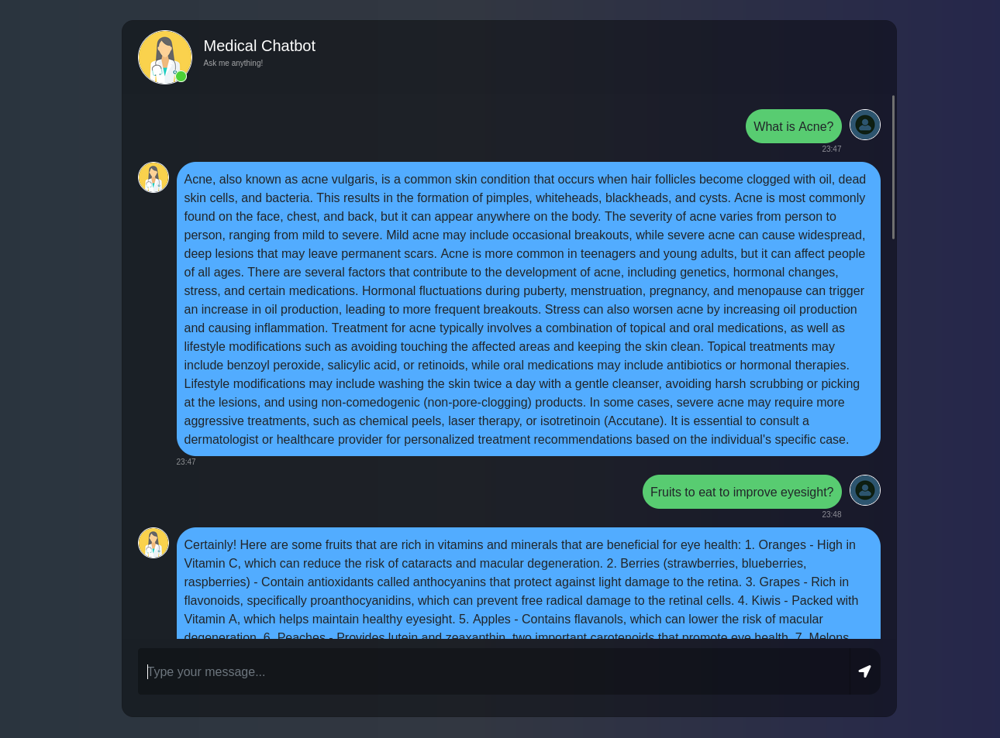

# Medical Chatbot Using GenAI

## Table of Contents
- [About The Project](#about-the-project)
- [Features](#features)
- [Project Structure](#project-structure)
- [Tech Stack](#tech-stack)
- [Getting Started](#getting-started)
  - [Prerequisites](#prerequisites)
  - [Installation](#installation)
- [Usage](#usage)
- [Code Snippets](#code-snippets)
- [How It Works](#how-it-works)

## About The Project
The Project was developed as a part of Course Statistical Methods in Artificial Intelligence at IIIT Hyderabad. The goal was to create a medical chatbot that can answer questions based on a set of medical documents. The chatbot leverages RAG (Retrieval Augmented Generation) to provide factual medical information by combining the power of large language models with retrievable medical knowledge.
## Interactive Display


##  Features

- Intelligent medical chatbot powered by GPT
- PDF document processing for medical knowledge
- Vector search for accurate information retrieval
- RAG architecture for fact-based responses
- User-friendly web interface
- Real-time conversational experience
- Contextual understanding of medical queries
- Local deployment for data privacy
- Responsive design for all devices

## 📁 Project Structure

```
MediMind/
├── Data/                # Directory containing medical PDF documents 
├── src/
│   ├── helper.py        # Helper functions for document loading and processing 🛠️
│   └── prompt.py        # System prompts for the LLM 
├── templates/
│   └── chat.html        # HTML template for the chat interface 
├── app.py               # Main Flask application 
├── requirements.txt     # Project dependencies 
├── setup.py             # Setup script for the package 
├── store_index.py       # Script to create and populate the vector index 
└── README.md            # Project documentation 
```

## 🛠️ Tech Stack

- **Python 3.10**  - Programming Language
- **Flask**  - Web framework
- **LangChain**  - Framework for LLM applications
- **OpenAI**  - GPT model for natural language processing
- **Pinecone**  - Vector database for storing embeddings
- **HuggingFace**  - Embeddings model (sentence-transformers)
- **HTML/CSS/JS**  - Frontend for the chat interface
- **Conda**  - Environment management

## Getting Started

Follow these instructions to set up and run the project on your local machine.

### Prerequisites

- Python 3.10 or higher 
- Conda (recommended for environment management) 
- Pinecone API Key 
- OpenAI API Key 
- Medical PDF documents 

### Installation

1. **Clone the repository** 

2. **Create and activate Conda environment** 

3. **Install required packages** 
   ```bash
   pip install -r requirements.txt
   ```

4. **Set up environment variables** 
   
   Create a `.env` file in the root directory and add your API keys:
   ```
   PINECONE_API_KEY="your_pinecone_api_key"
   OPENAI_API_KEY="your_openai_api_key"
   ```

5. **Prepare your medical PDF documents** 
   
   Place your medical PDF documents in the `Data/` directory.

6. **Create and populate the vector index** 
   ```bash
   python store_index.py
   ```
   
   This will:
   - Load the PDF documents from the `Data/` directory 
   - Split them into text chunks 
   - Generate embeddings for each chunk 
   - Create a Pinecone index named "medicalbot" 
   - Store the embeddings in the Pinecone index 

7. **Run the application** 
   ```bash
   python3 app.py
   ```

8. **Access the chat interface** 
   
   Open your web browser and go to:
   ```
   http://localhost:8080
   ```

## 💬 Usage

1. Access the web interface at `http://localhost:8080` 
2. Type your medical questions in the chat input 🔍
3. Get responses based on the medical documents provided 

Example questions you can ask:
- "What are the symptoms of diabetes?" 
- "How does hypertension affect the heart?" 
- "What are the side effects of aspirin?" 
- "How should I manage my chronic pain?" 

The chatbot uses retrieval-augmented generation to provide accurate answers based on the medical documents you've provided in the `Data/` directory. 

## 💻 Code Snippets

### 1. Loading and Processing PDF Documents 

```python
# From helper.py
def load_pdf_file(data):
    loader = DirectoryLoader(data,
                            glob="*.pdf",
                            loader_cls=PyPDFLoader)

    documents = loader.load()
    return documents

def text_split(extracted_data):
    text_splitter = RecursiveCharacterTextSplitter(chunk_size=500, chunk_overlap=20)
    text_chunks = text_splitter.split_documents(extracted_data)
    return text_chunks
```

### 2. Creating Embeddings 

```python
# From helper.py
def download_hugging_face_embeddings():
    embeddings = HuggingFaceEmbeddings(model_name='sentence-transformers/all-MiniLM-L6-v2')
    return embeddings
```

### 3. Setting Up the Flask Application 

```python
# From app.py
app = Flask(__name__)

load_dotenv()

PINECONE_API_KEY = os.environ.get('PINECONE_API_KEY')
OPENAI_API_KEY = os.environ.get('OPENAI_API_KEY')

# Set up retriever and language model
embeddings = download_hugging_face_embeddings()
docsearch = PineconeVectorStore.from_existing_index(
    index_name="medicalbot",
    embedding=embeddings
)
retriever = docsearch.as_retriever(search_type="similarity", search_kwargs={"k":3})
```

### 4. Creating the RAG Chain 

```python
# From app.py
llm = OpenAI(temperature=0.4, max_tokens=500)
prompt = ChatPromptTemplate.from_messages([
    ("system", system_prompt),
    ("human", "{input}"),
])

question_answer_chain = create_stuff_documents_chain(llm, prompt)
rag_chain = create_retrieval_chain(retriever, question_answer_chain)
```

### 5. Processing Chat Requests 

```python
# From app.py
@app.route("/get", methods=["GET", "POST"])
def chat():
    msg = request.form["msg"]
    input = msg
    print(input)
    response = rag_chain.invoke({"input": msg})
    print("Response : ", response["answer"])
    return str(response["answer"])
```

## 🧪 How It Works

1. **Document Processing** :
   - Medical PDFs are loaded and processed through `DirectoryLoader` and `PyPDFLoader`
   - Documents are split into manageable chunks using `RecursiveCharacterTextSplitter`
   - Text chunks are converted into embeddings using HuggingFace models (384 dimensions)

2. **Vector Database Setup** :
   - Pinecone serverless instance is created in AWS
   - Embeddings are stored with document references for retrieval
   - Vector similarity search is used to find relevant information

3. **Retrieval System** :
   - User queries are converted to embeddings using the same model
   - Similar document chunks are retrieved from Pinecone using cosine similarity
   - The top 3 most relevant chunks are selected (`k=3`)

4. **Response Generation** :
   - Retrieved information is fed to the LLM (OpenAI)
   - System prompt guides the LLM to use the context for answers
   - Temperature setting of 0.4 balances creativity and accuracy
   - The LLM generates a concise response (max 3 sentences)
   - Response is returned to the user through the Flask web interface

5. **User Experience** :
   - Clean and intuitive chat interface
   - Real-time interaction with the medical knowledge base
   - Responses are focused on medical knowledge from the provided documents


